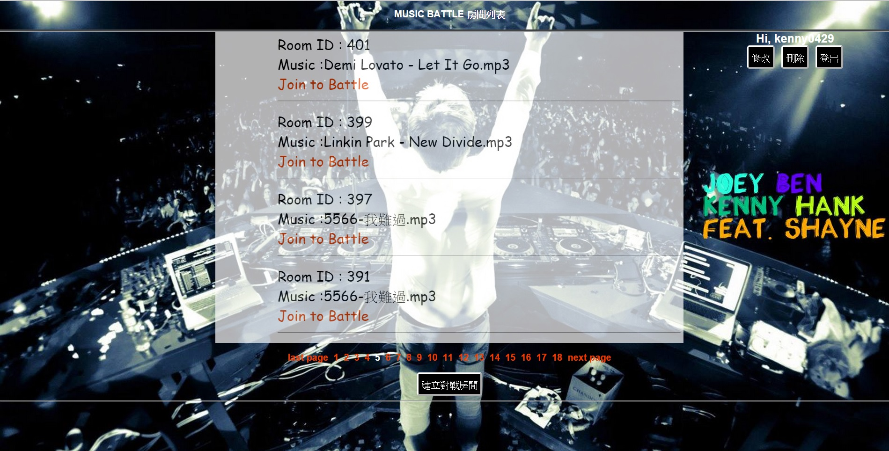
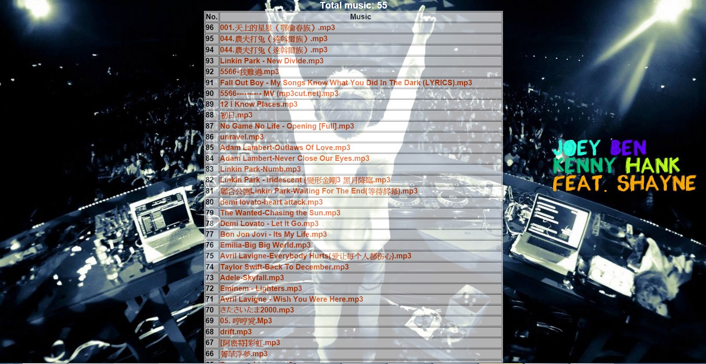
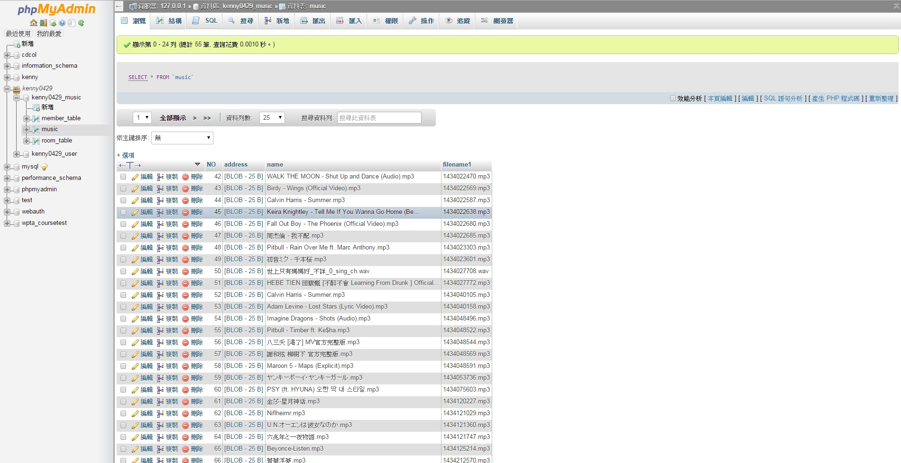

## Web-MusicBattle-Game--online-version
Index View:  

 Room View:  

 Music View:  

 Game View:  

 Database View:  

##Overview
A game project written in HTML/CSS/JavaScript/PHP/SQL. 
Use '↑' '↓' '←' '→' to hit on the beat and get high scores. 
If you hit on the beat without being interrupted , the game will be in Combo Mode and you can get more scores.  
##Deatail Report
[Report](https://drive.google.com/file/d/0B796WVmsjTFnaUxweUlzMXhycms/view?usp=sharing)
